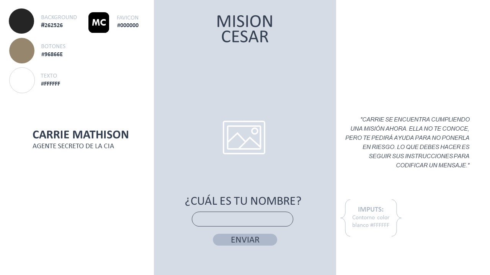

# Cifrado César

## Índice

* [1. Preámbulo](#1-preámbulo)
* [2. Resumen del proyecto](#2-resumen-del-proyecto)
* [3. Diseño](#3-diseño)
* [4. Instrucciones de Uso](#4-instrucciones-de-uso)
* [5. Checklist](#5-checklist)

***

## 1. Preámbulo

Cifrar significa codificar. El [cifrado César](https://en.wikipedia.org/wiki/Caesar_cipher)
es uno de los primeros métodos de cifrado conocidos. El emperador romano Julio
César lo usaba para enviar órdenes secretas a sus generales en los campos de
batalla.

El cifrado césar es una de las técnicas más simples para cifrar un mensaje. Es
un tipo de cifrado por sustitución, es decir que cada letra del texto original
es reemplazada por otra que se encuentra un número fijo de posiciones
(desplazamiento) más adelante en el mismo alfabeto.

Por ejemplo, si usamos un desplazamiento (_offset_) de 3 posiciones:

* La letra A se cifra como D.
* La palabra CASA se cifra como FDVD.
* Alfabeto sin cifrar: A B C D E F G H I J K L M N O P Q R S T U V W X Y Z
* Alfabeto cifrado: D E F G H I J K L M N O P Q R S T U V W X Y Z A B C

En la actualidad, todos los cifrados de sustitución simple se descifran con
mucha facilidad y, aunque en la práctica no ofrecen mucha seguridad en la
comunicación por sí mismos; el cifrado César sí puede formar parte de sistemas
más complejos de codificación, como el cifrado Vigenère, e incluso tiene
aplicación en el sistema ROT13.

## 2. Resumen del proyecto

### Nombre del Proyecto:

"Misión César"

### Descripción:

Misión César es una web interactiva de acción y misterio, orientada al entretenimiento. Está basada
en una de las técnicas de cifrado más simples y conocidas, “El Cifrado César”.

MC nos presenta a Carrie Mathison, agente secreto de la CIA, quien tiene una misión que
no puede poner en riesgo y debe pedir ayuda a un extraño (usuario) para cumplir su cometido siguiendo
sus instrucciones, que consisten en cifrar y descifrar un mensaje, utilizando un número de desplazamiento (clave).

### Principal usuario del producto:

El principal usuario de MC, son todas las personas interesadas en buscar una actividad de ocio y/o entretenimiento, es decir ocio digital.
Está comprobado que el ocio es necesario para obtener un mejor rendimiento, tanto físico como mental, en nuestra actividad laboral. Sea cual sea nuestra ocupación, es siempre aconsejable respetar los ratos libres, buscarlos y atesorarlos, para recobrar las energías que hemos depositado en nuestras obligaciones y poder retomarlas de manera eficiente y con la mente despejada.  

## 3. Diseño

### Boceto:

Inicialmente, el nombre de la web se presentó en inglés (Caesar Mission), se plantearon tres páginas donde la
primera de ellas explique brevemente la historia de la web interactiva e invitara al usuario a ayudar a Carrie,
la Agente Secreto de la CIA, a cumplir su misión. Se agregó un campo para colocar nombre de usuario y el botón
“ENVIAR” para mandar la información y pasar a la siguiente página.

En la segunda página se colocó un mensaje personalizado, tomando el nombre del usuario e indicando las
instrucciones de la misión. Además, se agregó un botón de siguiente.

En la tercer y última página se colocaron dos campos de texto para los mensajes, un campo de desplazamiento
numérico para la clave y dos botones con las acciones de “CIFRAR” / “DESCIFRAR”.

### Prototipo de baja fidelidad:

Se propusieron los colores y formas de la web. Asimismo, se decidió cambiar el nombre al castellano (Misión César)
para que esté alineado con todo el diálogo del proyecto. Además, se colocó un “FAVICON” para identificar la pestaña
de la web con las iniciales del proyecto.

Se decidió mantener el contenido de la primera página y cambiar únicamente la interacción de solicitud de nombre de
usuario por el mensaje personalizado con las instrucciones. También, se agregó el botón “EMPECEMOS” para pasar a la
siguiente página e iniciar la misión de cifrar/descifrar.

Finalmente, en la última página se propuso la idea de permitir al usuario empezar un nuevo mensaje y/o retornar al
inicio de la misión. Por lo que, se adicionaron dos botones con las acciones de “BORRAR” y “HOME”.

### Vista final de la página web

## 4. Instrucciones de uso

1. Se deberá leer la historia para entrar en contexto y conocer la temática de la web.

2. Ingresar nombre de usuario y hacer click en el botón "ENVIAR" para recibir
las instrucciones.

3. Aparecerá el nombre del usuario y las instrucciones.

4. Considerar usar un número clave del 1 al 33 para cifrar el mensaje

5. Hacer click en el botón "EMPECEMOS" para dirigirnos a la siguiente página.

6. Se encontrará con los campos de texto, "MENSAJE ORIGINAL" y "MENSAJE CIFRADO/DESCIFRADO".

7. Ingresar el mensaje en el campo texto "MENSAJE ORIGINAL", el cual admite minúsculas o mayúsculas,
pero no puedes utilizar la letra "ñ", ni caracteres especiales.

8. Ingresar la clave, es decir el número de caracteres que deseas desplazar el texto.

9. Elegir la opción "CIFRAR o DESCIFRAR".

10. El resultado aparecerá en el campo de texto "MENSAJE CIFRADO/DESCIFRADO".

11. Para limpiar los campos de texto, la clave o iniciar de nuevo, haz click en el botón "BORRAR".

12. Para regresar al inicio de la página, haz click en el botón "HOME".

## 5. Checklist

### Parte Obligatoria

* [x] `README.md` incluye info sobre proceso y decisiones de diseño.
* [x] `README.md` explica claramente quiénes son los usuarios y su relación con
  el producto.
* [x] `README.md` explica claramente cómo el producto soluciona los
  problemas/necesidades de los usuarios.
* [x] Usa VanillaJS.
* [x] Implementa `cipher.encode`.
* [x] Implementa `cipher.decode`.
* [x] Pasa linter con configuración provista.
* [x] Pasa pruebas unitarias.
* [x] Pruebas unitarias cubren 70% de _statements_, _functions_ y _lines_, y un
  mínimo del 50% de _branches_.
* [x] Interfaz permite elegir el `offset` o _desplazamiento_ a usar en el
  cifrado/descifrado.
* [x] Interfaz permite escribir un texto para ser cifrado.
* [x] Interfaz muestra el resultado del cifrado correctamente.
* [x] Interfaz permite escribir un texto para ser descifrado.
* [x] Interfaz muestra el resultado del descifrado correctamente.

### Parte Opcional: "Hacker edition"

* [x] Cifra/descifra minúsculas
* [ ] Cifra/descifra _otros_ caracteres (espacios, puntuación, `ñ`, `á`, ...)
* [ ] Permite usar un `offset` negativo.
